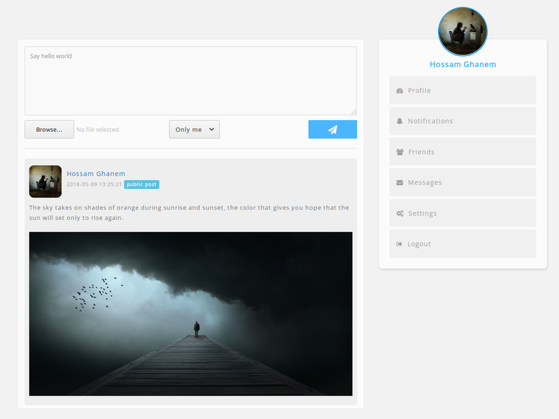
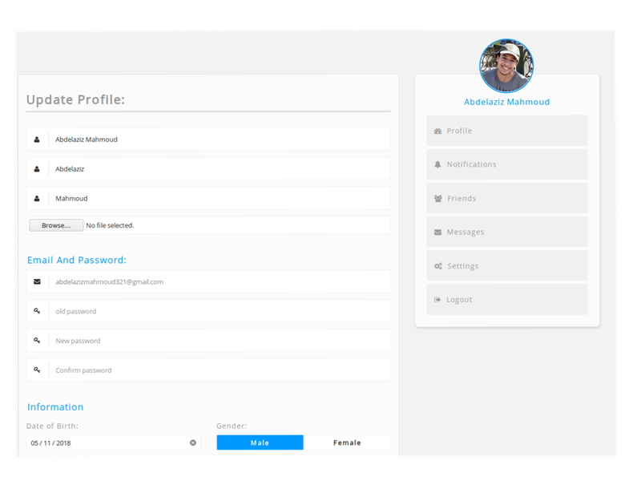
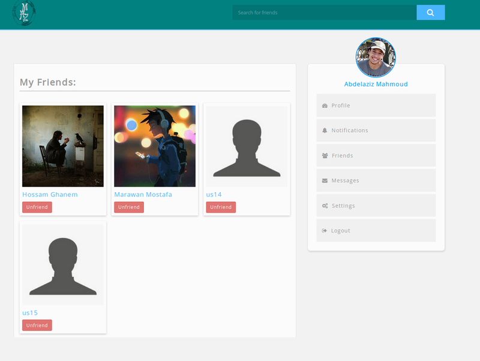
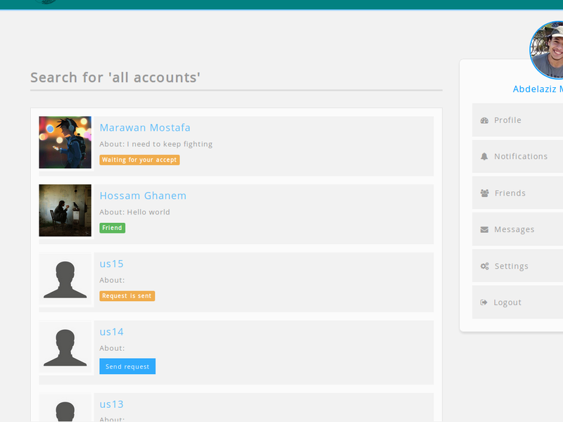

## MHZ social media

MHZ is a web application that people use to build social networks or social relations with other people who share similar personal or career interests, activities, backgrounds or real-life connections.

### Installation

1- Clone the repository.

```
git clone https://github.com/abdelaziz321/MHZ
```

2- Use the file `dev/database/MHZ.sql` to create `MHZ` database.

3- Edit the `username` and `password` in the `$_config` array with the appropriate credential for your database server.

4- Change the directory into MHZ folder.

```
cd MHZ
```

5- Run the application using the `PHP Built-in web server` or whatever.

```
php -S 127.0.0.1:8000
```

6- Now go to `http://127.0.0.1:8000` from your browser.

___

### Screenshots








___

#### Why Building This
This application is only for learning purpose as an assignment for `C302`.

`Alexandria university - Faculty Of Science - Computer Sciences Department - C302 'DBMS'`
